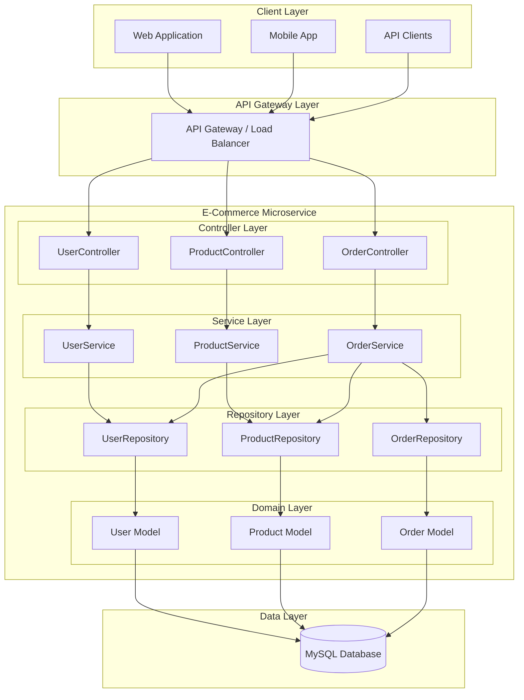
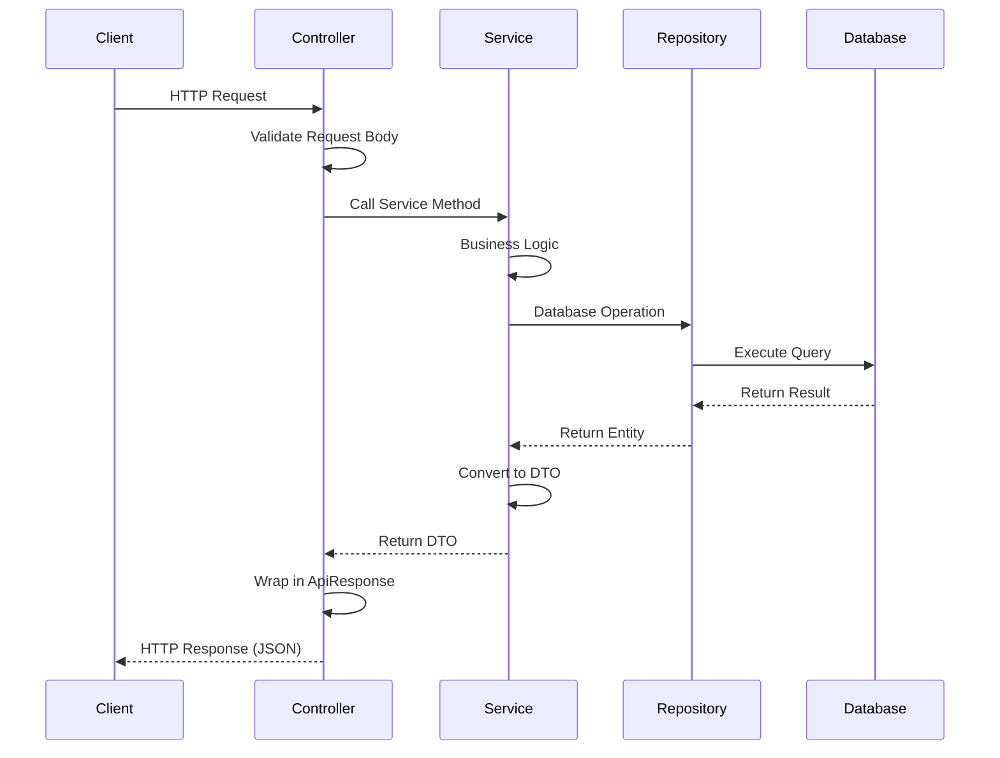
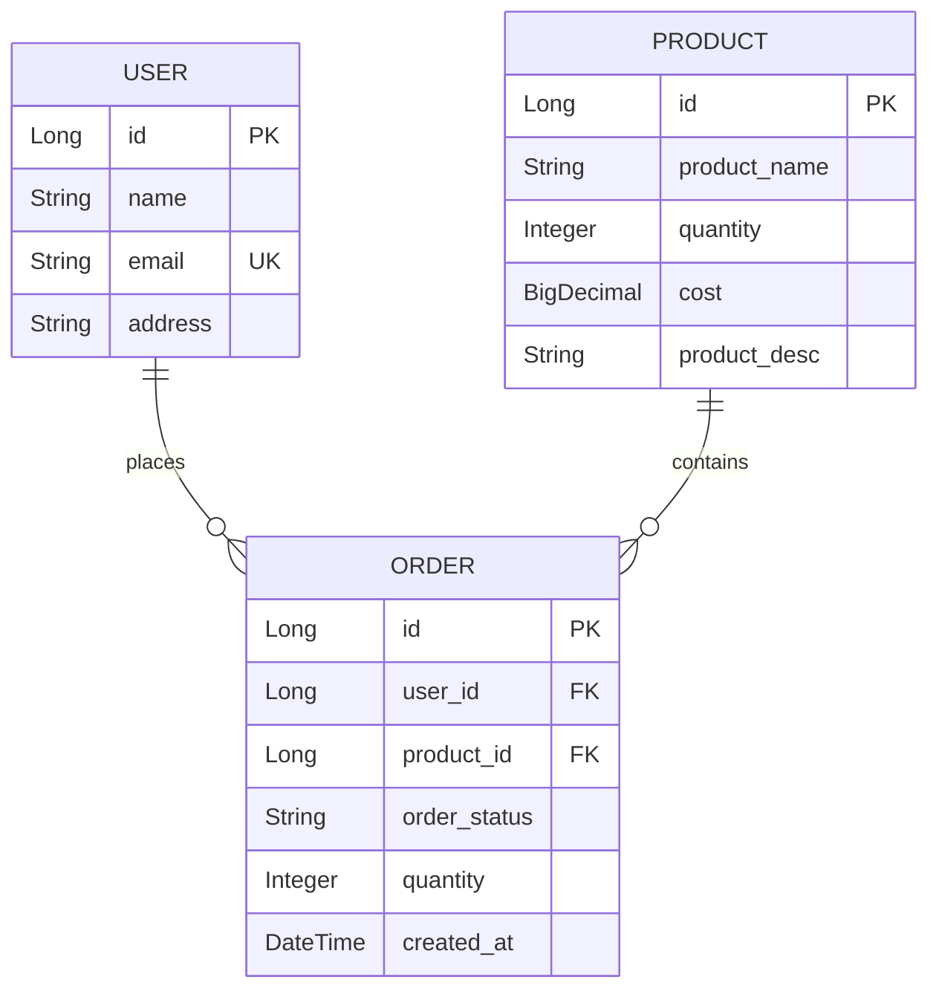
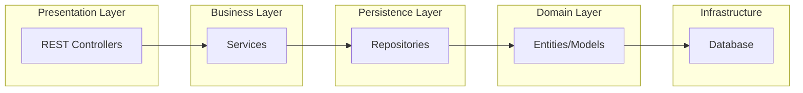
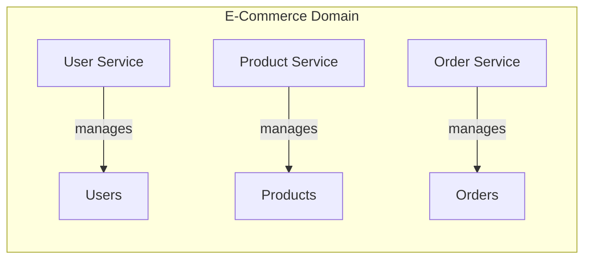
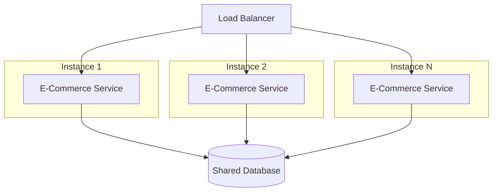
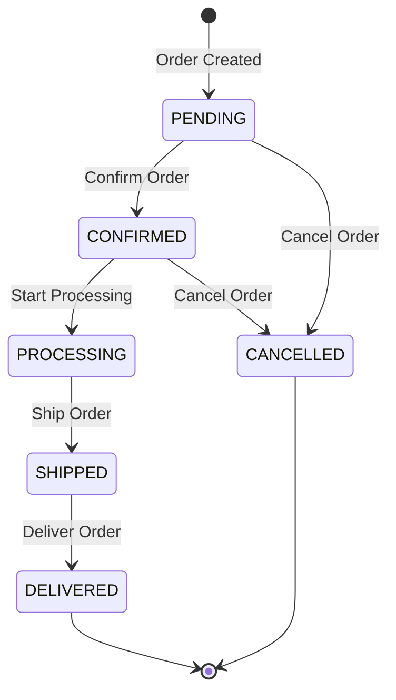

# E-Commerce Microservice Platform
# ShopHub
A robust, scalable e-commerce backend built with Spring Boot following microservice architecture principles.

## Table of Contents

- [Overview](#overview)
- [Architecture](#architecture)
- [Technology Stack](#technology-stack)
- [Project Structure](#project-structure)
- [Database Schema](#database-schema)
- [API Documentation](#api-documentation)
  - [User APIs](#user-apis)
  - [Product APIs](#product-apis)
  - [Order APIs](#order-apis)
- [Microservice Characteristics](#microservice-characteristics)
- [Getting Started](#getting-started)
- [Sample Requests & Responses](#sample-requests--responses)

---

## Overview

This e-commerce platform provides a complete backend solution for managing:
- **Users** - Customer registration and management
- **Products** - Product catalog with inventory management
- **Orders** - Order processing with status tracking

The application follows REST API best practices with proper error handling, validation, and standardized response formats.

---

## Architecture

### High-Level Architecture



### Request-Response Flow



### Entity Relationship Diagram



### Layered Architecture



---

## Technology Stack

| Component | Technology |
|-----------|------------|
| Framework | Spring Boot 4.0.0 |
| Language | Java 17 |
| Database | MySQL 8.x |
| ORM | Spring Data JPA / Hibernate |
| Validation | Jakarta Validation |
| Build Tool | Maven |
| Code Generation | Lombok |

---

## Project Structure

```
src/main/java/com/example/ecommerce/
├── EcommerceApplication.java          # Main Spring Boot Application
├── controllers/                        # REST API Controllers
│   ├── UserController.java
│   ├── ProductController.java
│   └── OrderController.java
├── services/                           # Business Logic Layer
│   ├── UserService.java
│   ├── ProductService.java
│   └── OrderService.java
├── repositories/                       # Data Access Layer
│   ├── UserRepository.java
│   ├── ProductRepository.java
│   └── OrderRepository.java
├── models/                             # JPA Entities
│   ├── User.java
│   ├── Product.java
│   ├── Order.java
│   └── OrderStatus.java
├── dto/                                # Data Transfer Objects
│   ├── UserDTO.java
│   ├── ProductDTO.java
│   ├── OrderDTO.java
│   └── ApiResponse.java
└── exceptions/                         # Exception Handling
    ├── ResourceNotFoundException.java
    ├── DuplicateResourceException.java
    ├── InsufficientStockException.java
    └── GlobalExceptionHandler.java
```

---

## Database Schema

### Users Table
| Column | Type | Constraints |
|--------|------|-------------|
| id | BIGINT | PRIMARY KEY, AUTO_INCREMENT |
| name | VARCHAR(255) | NOT NULL |
| email | VARCHAR(255) | NOT NULL, UNIQUE |
| address | VARCHAR(500) | NULLABLE |

### Products Table
| Column | Type | Constraints |
|--------|------|-------------|
| id | BIGINT | PRIMARY KEY, AUTO_INCREMENT |
| product_name | VARCHAR(255) | NOT NULL |
| quantity | INT | NOT NULL, MIN 0 |
| cost | DECIMAL(10,2) | NOT NULL |
| product_desc | VARCHAR(1000) | NULLABLE |

### Orders Table
| Column | Type | Constraints |
|--------|------|-------------|
| id | BIGINT | PRIMARY KEY, AUTO_INCREMENT |
| user_id | BIGINT | FOREIGN KEY → users(id) |
| product_id | BIGINT | FOREIGN KEY → products(id) |
| order_status | VARCHAR(20) | ENUM |
| quantity | INT | NOT NULL |
| created_at | DATETIME | NOT NULL, AUTO |

---

## API Documentation

### Base URL
```
http://localhost:8080/api
```

### Standard Response Format
All API responses follow this structure:
```json
{
    "success": true,
    "message": "Operation successful",
    "data": { ... },
    "timestamp": "2025-12-17T10:30:00"
}
```

---

### User APIs

| Method | Endpoint | Description |
|--------|----------|-------------|
| GET | `/users` | Get all users |
| GET | `/users/{id}` | Get user by ID |
| GET | `/users/email/{email}` | Get user by email |
| POST | `/users` | Create new user |
| PUT | `/users/{id}` | Update user |
| DELETE | `/users/{id}` | Delete user |

---

### Product APIs

| Method | Endpoint | Description |
|--------|----------|-------------|
| GET | `/products` | Get all products |
| GET | `/products/{id}` | Get product by ID |
| GET | `/products/search?name={name}` | Search products by name |
| GET | `/products/max-cost?maxCost={cost}` | Get products under price |
| GET | `/products/available` | Get in-stock products |
| POST | `/products` | Create new product |
| PUT | `/products/{id}` | Update product |
| PATCH | `/products/{id}/quantity?quantity={qty}` | Update stock |
| DELETE | `/products/{id}` | Delete product |

---

### Order APIs

| Method | Endpoint | Description |
|--------|----------|-------------|
| GET | `/orders` | Get all orders |
| GET | `/orders/{id}` | Get order by ID |
| GET | `/orders/user/{userId}` | Get user's orders |
| GET | `/orders/status/{status}` | Get orders by status |
| GET | `/orders/user/{userId}/status/{status}` | Get user's orders by status |
| POST | `/orders` | Create new order |
| PATCH | `/orders/{id}/status?status={status}` | Update order status |
| DELETE | `/orders/{id}` | Delete/Cancel order |

**Order Statuses:** `PENDING`, `CONFIRMED`, `PROCESSING`, `SHIPPED`, `DELIVERED`, `CANCELLED`

---

## Microservice Characteristics

This application demonstrates key microservice architecture principles:

### 1. **Single Responsibility**

Each service handles one specific domain - Users, Products, or Orders.

### 2. **Loose Coupling**
- Services communicate through well-defined interfaces (DTOs)
- Changes in one service don't directly affect others
- Repository pattern abstracts database operations

### 3. **High Cohesion**
- All user-related operations are in UserService
- All product-related operations are in ProductService
- All order-related operations are in OrderService

### 4. **RESTful API Design**
- Stateless communication
- Resource-based URLs (`/api/users`, `/api/products`, `/api/orders`)
- Standard HTTP methods (GET, POST, PUT, PATCH, DELETE)
- JSON request/response format

### 5. **Scalability Ready**


### 6. **Separation of Concerns**
| Layer | Responsibility |
|-------|---------------|
| Controller | Request handling, validation, response formatting |
| Service | Business logic, transaction management |
| Repository | Data access, queries |
| DTO | Data transfer between layers |
| Entity | Database mapping |

### 7. **Fault Tolerance**
- Global exception handling
- Standardized error responses
- Input validation at controller level
- Business rule validation at service level

---

## Getting Started

### Prerequisites
- Java 17+
- Maven 3.6+
- MySQL 8.x

### Database Setup
```sql
CREATE DATABASE ecommerce;
```

### Configuration
Update `src/main/resources/application.properties`:
```properties
spring.datasource.url=jdbc:mysql://localhost:3306/ecommerce
spring.datasource.username=your_username
spring.datasource.password=your_password
```

### Run Application
```bash
./mvnw spring-boot:run
```

The application will start on `http://localhost:8080`

---

## Sample Requests & Responses

### User APIs

#### Create User
```bash
curl -X POST http://localhost:8080/api/users \
  -H "Content-Type: application/json" \
  -d '{
    "name": "John Doe",
    "email": "john.doe@example.com",
    "address": "123 Main Street, New York, NY 10001"
  }'
```

**Response (201 Created):**
```json
{
    "success": true,
    "message": "User created successfully",
    "data": {
        "id": 1,
        "name": "John Doe",
        "email": "john.doe@example.com",
        "address": "123 Main Street, New York, NY 10001"
    },
    "timestamp": "2025-12-17T10:30:00"
}
```

#### Get All Users
```bash
curl -X GET http://localhost:8080/api/users
```

**Response (200 OK):**
```json
{
    "success": true,
    "message": "Users retrieved successfully",
    "data": [
        {
            "id": 1,
            "name": "John Doe",
            "email": "john.doe@example.com",
            "address": "123 Main Street, New York, NY 10001"
        },
        {
            "id": 2,
            "name": "Jane Smith",
            "email": "jane.smith@example.com",
            "address": "456 Oak Avenue, Los Angeles, CA 90001"
        }
    ],
    "timestamp": "2025-12-17T10:31:00"
}
```

#### Get User by ID
```bash
curl -X GET http://localhost:8080/api/users/1
```

**Response (200 OK):**
```json
{
    "success": true,
    "message": "User retrieved successfully",
    "data": {
        "id": 1,
        "name": "John Doe",
        "email": "john.doe@example.com",
        "address": "123 Main Street, New York, NY 10001"
    },
    "timestamp": "2025-12-17T10:32:00"
}
```

#### Update User
```bash
curl -X PUT http://localhost:8080/api/users/1 \
  -H "Content-Type: application/json" \
  -d '{
    "name": "John Doe Updated",
    "email": "john.updated@example.com",
    "address": "789 New Address, Chicago, IL 60601"
  }'
```

**Response (200 OK):**
```json
{
    "success": true,
    "message": "User updated successfully",
    "data": {
        "id": 1,
        "name": "John Doe Updated",
        "email": "john.updated@example.com",
        "address": "789 New Address, Chicago, IL 60601"
    },
    "timestamp": "2025-12-17T10:33:00"
}
```

#### Delete User
```bash
curl -X DELETE http://localhost:8080/api/users/1
```

**Response (200 OK):**
```json
{
    "success": true,
    "message": "User deleted successfully",
    "data": null,
    "timestamp": "2025-12-17T10:34:00"
}
```

---

### Product APIs

#### Create Product
```bash
curl -X POST http://localhost:8080/api/products \
  -H "Content-Type: application/json" \
  -d '{
    "productName": "iPhone 15 Pro",
    "quantity": 100,
    "cost": 999.99,
    "productDesc": "Latest Apple iPhone with A17 Pro chip, titanium design"
  }'
```

**Response (201 Created):**
```json
{
    "success": true,
    "message": "Product created successfully",
    "data": {
        "id": 1,
        "productName": "iPhone 15 Pro",
        "quantity": 100,
        "cost": 999.99,
        "productDesc": "Latest Apple iPhone with A17 Pro chip, titanium design"
    },
    "timestamp": "2025-12-17T10:35:00"
}
```

#### Get All Products
```bash
curl -X GET http://localhost:8080/api/products
```

**Response (200 OK):**
```json
{
    "success": true,
    "message": "Products retrieved successfully",
    "data": [
        {
            "id": 1,
            "productName": "iPhone 15 Pro",
            "quantity": 100,
            "cost": 999.99,
            "productDesc": "Latest Apple iPhone with A17 Pro chip"
        },
        {
            "id": 2,
            "productName": "Samsung Galaxy S24",
            "quantity": 75,
            "cost": 849.99,
            "productDesc": "Samsung flagship with Galaxy AI"
        }
    ],
    "timestamp": "2025-12-17T10:36:00"
}
```

#### Search Products by Name
```bash
curl -X GET "http://localhost:8080/api/products/search?name=iPhone"
```

**Response (200 OK):**
```json
{
    "success": true,
    "message": "Products retrieved successfully",
    "data": [
        {
            "id": 1,
            "productName": "iPhone 15 Pro",
            "quantity": 100,
            "cost": 999.99,
            "productDesc": "Latest Apple iPhone with A17 Pro chip"
        }
    ],
    "timestamp": "2025-12-17T10:37:00"
}
```

#### Get Products Under Max Cost
```bash
curl -X GET "http://localhost:8080/api/products/max-cost?maxCost=900"
```

**Response (200 OK):**
```json
{
    "success": true,
    "message": "Products retrieved successfully",
    "data": [
        {
            "id": 2,
            "productName": "Samsung Galaxy S24",
            "quantity": 75,
            "cost": 849.99,
            "productDesc": "Samsung flagship with Galaxy AI"
        }
    ],
    "timestamp": "2025-12-17T10:38:00"
}
```

#### Get Available Products (In Stock)
```bash
curl -X GET http://localhost:8080/api/products/available
```

**Response (200 OK):**
```json
{
    "success": true,
    "message": "Available products retrieved successfully",
    "data": [
        {
            "id": 1,
            "productName": "iPhone 15 Pro",
            "quantity": 100,
            "cost": 999.99,
            "productDesc": "Latest Apple iPhone"
        }
    ],
    "timestamp": "2025-12-17T10:39:00"
}
```

#### Update Product Stock
```bash
curl -X PATCH "http://localhost:8080/api/products/1/quantity?quantity=150"
```

**Response (200 OK):**
```json
{
    "success": true,
    "message": "Product quantity updated successfully",
    "data": {
        "id": 1,
        "productName": "iPhone 15 Pro",
        "quantity": 150,
        "cost": 999.99,
        "productDesc": "Latest Apple iPhone"
    },
    "timestamp": "2025-12-17T10:40:00"
}
```

---

### Order APIs

#### Create Order
```bash
curl -X POST http://localhost:8080/api/orders \
  -H "Content-Type: application/json" \
  -d '{
    "userId": 1,
    "productId": 1,
    "quantity": 2
  }'
```

**Response (201 Created):**
```json
{
    "success": true,
    "message": "Order created successfully",
    "data": {
        "id": 1,
        "userId": 1,
        "productId": 1,
        "orderStatus": "PENDING",
        "quantity": 2,
        "createdAt": "2025-12-17T10:41:00",
        "userName": "John Doe",
        "productName": "iPhone 15 Pro"
    },
    "timestamp": "2025-12-17T10:41:00"
}
```

#### Get All Orders
```bash
curl -X GET http://localhost:8080/api/orders
```

**Response (200 OK):**
```json
{
    "success": true,
    "message": "Orders retrieved successfully",
    "data": [
        {
            "id": 1,
            "userId": 1,
            "productId": 1,
            "orderStatus": "PENDING",
            "quantity": 2,
            "createdAt": "2025-12-17T10:41:00",
            "userName": "John Doe",
            "productName": "iPhone 15 Pro"
        }
    ],
    "timestamp": "2025-12-17T10:42:00"
}
```

#### Get Orders by User
```bash
curl -X GET http://localhost:8080/api/orders/user/1
```

**Response (200 OK):**
```json
{
    "success": true,
    "message": "User orders retrieved successfully",
    "data": [
        {
            "id": 1,
            "userId": 1,
            "productId": 1,
            "orderStatus": "PENDING",
            "quantity": 2,
            "createdAt": "2025-12-17T10:41:00",
            "userName": "John Doe",
            "productName": "iPhone 15 Pro"
        }
    ],
    "timestamp": "2025-12-17T10:43:00"
}
```

#### Get Orders by Status
```bash
curl -X GET http://localhost:8080/api/orders/status/PENDING
```

**Response (200 OK):**
```json
{
    "success": true,
    "message": "Orders retrieved successfully",
    "data": [
        {
            "id": 1,
            "userId": 1,
            "productId": 1,
            "orderStatus": "PENDING",
            "quantity": 2,
            "createdAt": "2025-12-17T10:41:00",
            "userName": "John Doe",
            "productName": "iPhone 15 Pro"
        }
    ],
    "timestamp": "2025-12-17T10:44:00"
}
```

#### Update Order Status
```bash
curl -X PATCH "http://localhost:8080/api/orders/1/status?status=CONFIRMED"
```

**Response (200 OK):**
```json
{
    "success": true,
    "message": "Order status updated successfully",
    "data": {
        "id": 1,
        "userId": 1,
        "productId": 1,
        "orderStatus": "CONFIRMED",
        "quantity": 2,
        "createdAt": "2025-12-17T10:41:00",
        "userName": "John Doe",
        "productName": "iPhone 15 Pro"
    },
    "timestamp": "2025-12-17T10:45:00"
}
```

#### Cancel Order
```bash
curl -X PATCH "http://localhost:8080/api/orders/1/status?status=CANCELLED"
```

**Response (200 OK):**
```json
{
    "success": true,
    "message": "Order status updated successfully",
    "data": {
        "id": 1,
        "userId": 1,
        "productId": 1,
        "orderStatus": "CANCELLED",
        "quantity": 2,
        "createdAt": "2025-12-17T10:41:00",
        "userName": "John Doe",
        "productName": "iPhone 15 Pro"
    },
    "timestamp": "2025-12-17T10:46:00"
}
```

> **Note:** When an order is cancelled, the product quantity is automatically restored.

---

### Error Responses

#### Resource Not Found (404)
```bash
curl -X GET http://localhost:8080/api/users/999
```

**Response:**
```json
{
    "success": false,
    "message": "User not found with id: 999",
    "data": null,
    "timestamp": "2025-12-17T10:47:00"
}
```

#### Duplicate Resource (409)
```bash
curl -X POST http://localhost:8080/api/users \
  -H "Content-Type: application/json" \
  -d '{
    "name": "Another User",
    "email": "john.doe@example.com",
    "address": "Some Address"
  }'
```

**Response:**
```json
{
    "success": false,
    "message": "User already exists with email: john.doe@example.com",
    "data": null,
    "timestamp": "2025-12-17T10:48:00"
}
```

#### Insufficient Stock (400)
```bash
curl -X POST http://localhost:8080/api/orders \
  -H "Content-Type: application/json" \
  -d '{
    "userId": 1,
    "productId": 1,
    "quantity": 1000
  }'
```

**Response:**
```json
{
    "success": false,
    "message": "Insufficient stock. Available: 100, Requested: 1000",
    "data": null,
    "timestamp": "2025-12-17T10:49:00"
}
```

#### Validation Error (400)
```bash
curl -X POST http://localhost:8080/api/users \
  -H "Content-Type: application/json" \
  -d '{
    "name": "",
    "email": "invalid-email"
  }'
```

**Response:**
```json
{
    "success": false,
    "message": "Validation failed",
    "data": {
        "name": "Name is required",
        "email": "Please provide a valid email"
    },
    "timestamp": "2025-12-17T10:50:00"
}
```

---

## Business Logic Features

### Inventory Management
- **Automatic Stock Deduction**: When an order is placed, product quantity is reduced
- **Stock Restoration**: When an order is cancelled, product quantity is restored
- **Stock Validation**: Orders cannot be placed if insufficient stock

### Order Lifecycle


---

## Future Enhancements

To make this a complete microservices ecosystem, consider:

1. **Service Discovery** - Eureka/Consul
2. **API Gateway** - Spring Cloud Gateway
3. **Circuit Breaker** - Resilience4j
4. **Distributed Tracing** - Zipkin/Jaeger
5. **Message Queue** - RabbitMQ/Kafka for async operations
6. **Caching** - Redis for product catalog
7. **Authentication** - Spring Security + JWT
8. **Containerization** - Docker + Kubernetes

---

## License

This project is for educational purposes.

---

## Author

Built with ❤️ using Spring Boot
